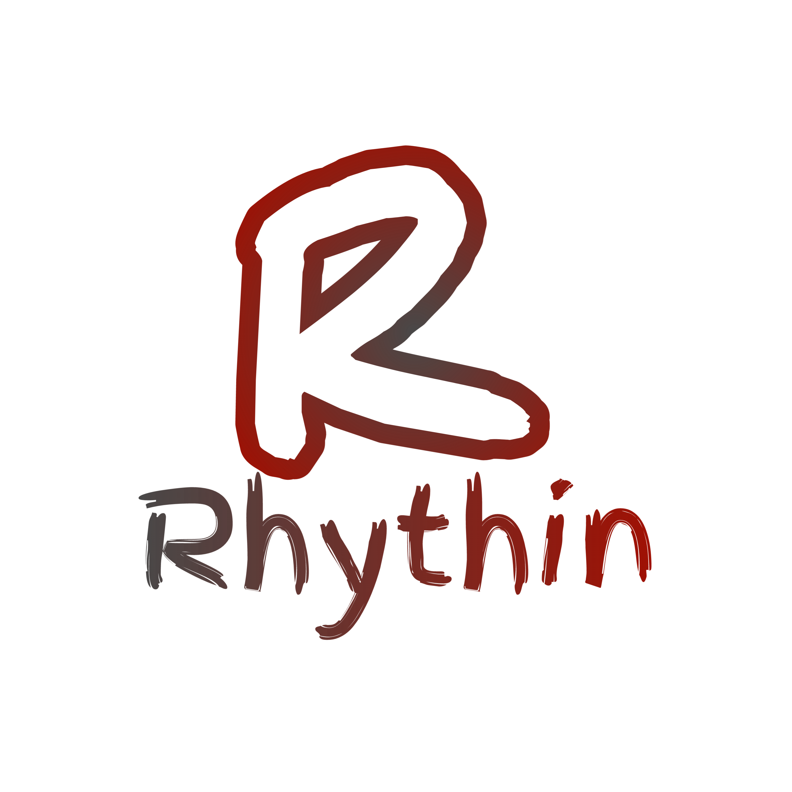

<p align="center">
  
</p>

<h1 align="center">Rhythin Programming Language</h1>

<p align="center">
  <a href="https://github.com/el-rafa-dev/rhythinl/actions/workflows/cmake-multi-platform.yml">
    
  </a>
  <!-- <br> -->
  <a href="./licenses/LICENSE">
    
  </a>
</p>

RhythinLang will be a statically typed, interpreted and compiled (not JIT) programming language focused on being objective and direct to execute on Command Line Interface (CLI), facilitating learning for both beginners and programmers with experience in the area.

## Current Status

The current status is development and tests.

## When will be released?

The first version for general use will be when it has the basic syntax of a language for work. Types, structures, etc.


## How use/Example
```
; this is only a little example
; the semicolon characther (; or #) is for comments inline
; here we will be create the main function 
; thats will be a func type.
```
```
def main:func() -> [
    printnl("Hello World from Rhythin!") ;; writing a message on console/terminal
    finish(0) ;; sucess code
]
```
## Compability

| Works on Linux | Works on Windows |
| -------------- | ---------------- |
|✅ Works        | ✅ Works         |

## CLI Commands

|    Command   |    Description   |
| --- | --- |
| -f or --file |  use to open e and execute a rhythin (.ry) file (requerid a path after argument!)|
| -v or --version | displays a ASCII art and version of Rhythin |
| -h or --help | displays a arguments list |

## Building on Linux
To build and run the project on linux, do this below:

clone the repository with:
```
git clone https://github.com/el-rafa-dev/rhythinl.git
```
Run this commands:
```
cmake -B build -DCMAKE_BUILD_TYPE=Release
```
Run this for start the build on the "/build" directory
```
cmake --build build
```
The build will be finished and you can run Rhythin with:

```bash
./build/rhythin
```

## Building on Windows (With mingw64. See [warning](#warning) first before proceeding):
clone the repository with:
```
git clone https://github.com/el-rafa-dev/rhythinl.git
````
Run this command:
```
cmake -G "MinGW Makefiles" -B build -DCMAKE_BUILD_TYPE=Release -DCMAKE_C_COMPILER="C:\mingw64\bin\gcc.exe" -DCMAKE_CXX_COMPILER="C:\mingw64\bin\g++.exe"
````
Inside of rhythin dir, run:
```
cd build
```
Execute the mingw32-make inside of build dir:
```
mingw32-make
```
The build will be finished and you can be run the rhythin executable saved in build directory with:
```
.\rhythin.exe
```

## Warning
You need to have mingw64 configured first before proceeding

See how [configure](./CONFIGURE_MINGW.md) the mingw in windows


## Supporting
Go to [support.md](./SUPPORT.md) to see how support the project

## License

License of Rhythin changed to GNU GPLv3.

Click [here](./licenses/LICENSE) to see and read the license.


## Contact
Contact with me via telegram! My user id: [@rafaprobr](https://t.me/rafaprobr)

## A picture of --help and --version
</img>
